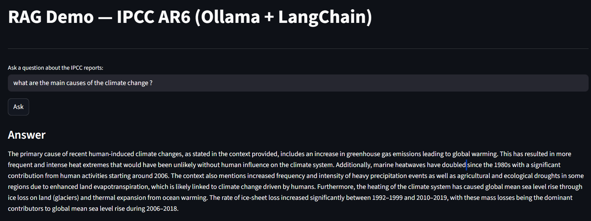

# Local RAG with Ollama + ChromaDB

Lightweight Retrieval-Augmented Generation (RAG) demo using:
- FastAPI backend (app.py)
- Ollama for local LLM + embeddings
- ChromaDB for vector store
- Streamlit UI (optional)



## Quick overview
This project answers user questions by retrieving relevant documents from a local Chroma vector store and using a local Ollama LLM to generate the final answer. The /ask endpoint returns both an answer and a list of source metadata.

## Requirements
- Windows (tested)
- Ollama running locally (https://ollama.ai)
- Pull models used in this repo:
  - `phi3:mini` (LLM)
  - `nomic-embed-text:latest` (embeddings)
- Python 3.10+ (venv recommended)

## Setup (PowerShell)
```bash
python -m venv .venv
.venv\Scripts\Activate.ps1
pip install -r [requirements.txt](http://_vscodecontentref_/0)
# Ensure Ollama is running and pull models:
ollama pull phi3:mini
ollama pull nomic-embed-text:latest